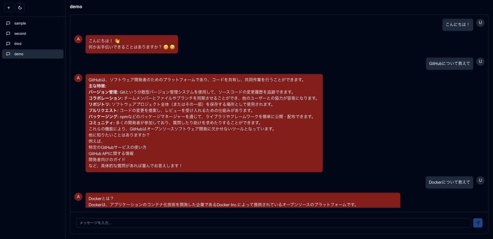
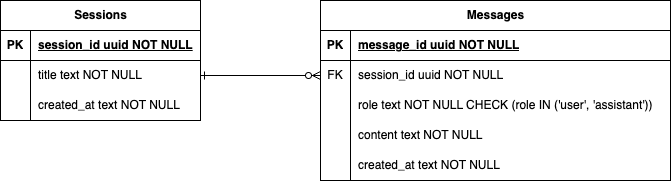

# Chat LLM

Fast API + Next.js で作成したチャットアプリケーションです。
Supabaseを使用して、ユーザーのセッション情報を管理します。

## デモ画像



## 環境構築

### database

1. Supabase のアカウントを作成し、プロジェクトを作成する
2. SQL Editor から`back/db/schema.sql`を実行し、テーブルを作成する

### back

1. `back`ディレクトリで以下のコマンドを実行し、依存パッケージをインストールする

   ```bash
   uv sync
   ```

2. `back`ディレクトリで以下のコマンドを実行し、開発サーバーを立ち上げる
   ```bash
   make dev
   ```

### front

1. `front`で使用する Node.js と Yarn のバージョンを設定する

   ```bash
   volta install node
   volta install yarn
   ```

2. `front`ディレクトリで以下のコマンドを実行し、依存パッケージをインストールする

   ```bash
   yarn
   ```

3. `front`ディレクトリで`front/.env.local`を作成し、以下の環境変数を設定する

   ```
   NEXT_PUBLIC_API_BASE_URL=http://127.0.0.1:8000
   ```

4. `front`ディレクトリで以下のコマンドを実行し、開発サーバーを立ち上げる

   ```bash
   yarn dev
   ```

5. [http://localhost:3000](http://localhost:3000)へアクセスしてページが表示されれば OK

### ER 図



### TODO

- [x] チャット機能
- [x] セッション管理機能
- [ ] ユーザー登録機能
- [ ] ログイン機能
- [ ] オンプレミスデータベースの導入

## 利用しているAIモデルについて

本プロジェクトでは、以下の大規模言語モデル（LLM）を使用しています：

- **モデル名**: [SakanaAI/TinySwallow-1.5B-Instruct](https://huggingface.co/SakanaAI/TinySwallow-1.5B-Instruct)
- **ライセンス**:  
  - モデル本体は **Apache License 2.0** に準拠（Qwen由来）  
  - 学習データは **Gemma Terms** に従って利用（[Gemma 利用規約](https://ai.google.dev/gemma/terms)）

このモデルは研究・開発用途向けに提供されており、以下の条件を遵守して利用しています：

- 本プロジェクトは **非商用** かつ **教育目的** の開発です
- モデル出力の精度や内容は保証されません（研究プロトタイプとして利用）
- Gemmaの **Prohibited Use（禁止用途）** に該当する使い方は行っていません

> This model is provided for research and development purposes only. Commercial use is permitted only if you comply with both the Apache 2.0 License and the Gemma Terms, including the Prohibited Use section.

---

## ライセンス

このプロジェクトのソースコードは [MITライセンス](./LICENSE) のもとで公開されています。  
自由にご利用いただけますが、詳細は LICENSE ファイルをご確認ください。

使用モデルのライセンス情報：

- SakanaAI/TinySwallow-1.5B-Instruct  
  - モデル: Apache 2.0  
  - データ: Google Gemma Terms（[詳細はこちら](https://ai.google.dev/gemma/terms)）
